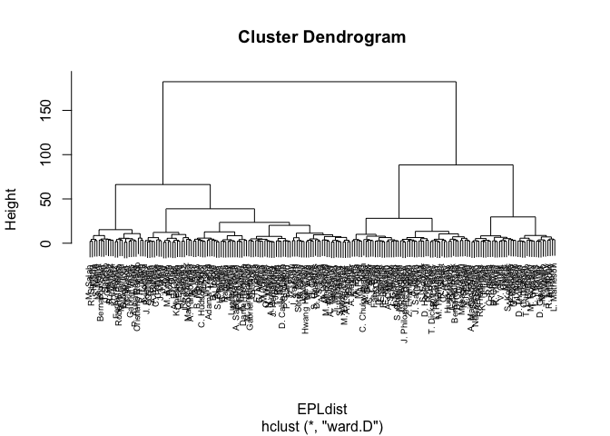
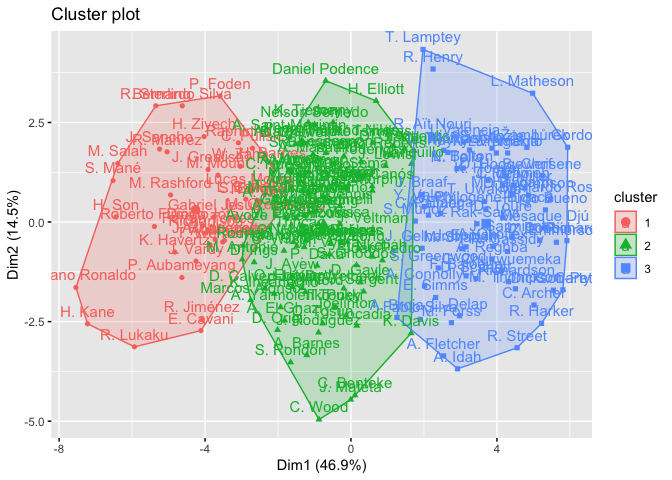
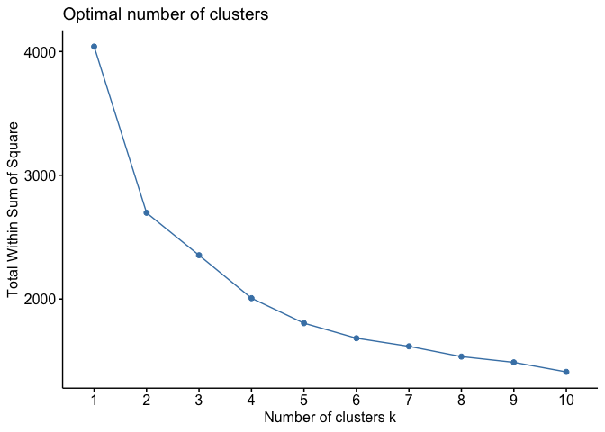
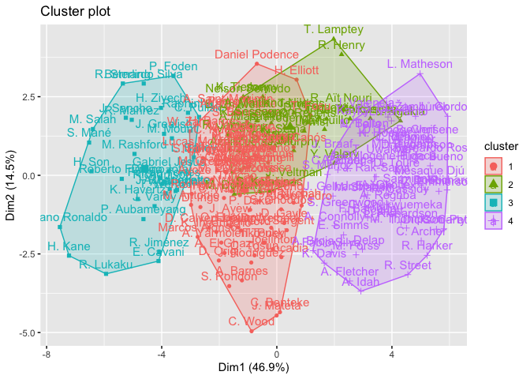
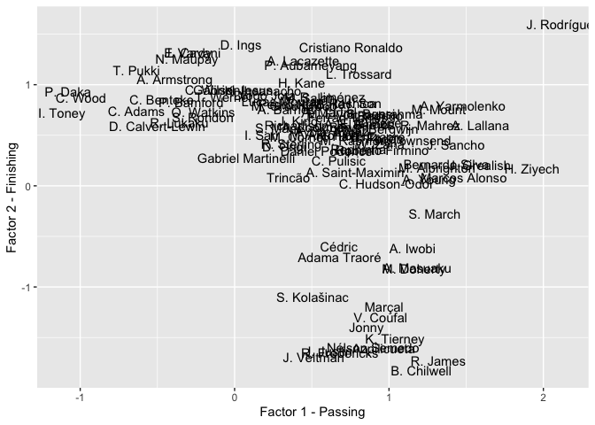
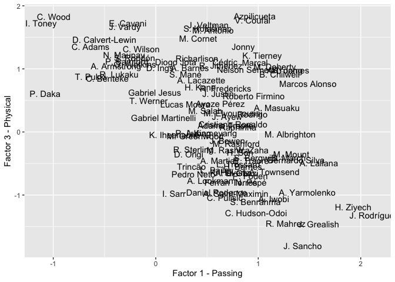
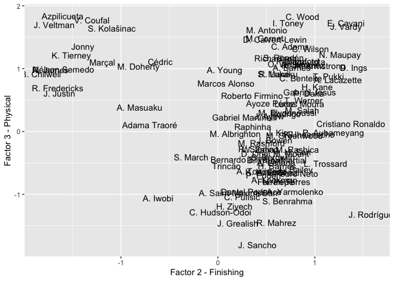

EPL player groupings with clustering and factor analysis
================

## Data

Data is from the FIFA 22 video game player rankings. These are released
every year for most professional players in the world (over 19k in this
data set). There are around 100 attributes that comprise the rankings.
In this particlar analysis I will focus on attacking players in the
English Premier league.

``` r
library(tidyverse)
library(stats)
library(factoextra)

players <- read_csv("players_22.csv")
```

## Extracting EPL attacking players as well as related attributes

Will need to create a subset of players and attributes needed.

``` r
EPL <- players %>%
  filter(league_name == "English Premier League") %>% 
  filter(str_detect(player_positions, 'ST|CF|LW|RW')) %>% 
  select(short_name, club_name, nationality_name,overall, potential, value_eur, wage_eur, age,
         height_cm, weight_kg, weak_foot, work_rate,
         skill_moves, pace, shooting, passing, dribbling, defending,
         physic, attacking_crossing, attacking_finishing, attacking_heading_accuracy,
         attacking_short_passing, attacking_volleys) %>% 
  mutate(across(where(is.numeric), scale))
```

203 players and 24 attributes.

## Hierarchical clustering

First clustering method. Data is scaled and using euclidean distance.

``` r
EPL2 <- EPL %>% 
  select(where(is.numeric)) %>% 
  as.data.frame()
rownames(EPL2) <- EPL$short_name

EPLdist <- dist(EPL2, method = "euclidean")
HCepl <- hclust(EPLdist, method = "ward.D") 
plot(HCepl, cex = 0.6)
```

<!-- -->

## K-means clustering

Second clustering method. Initiallly using 3 clusters.

``` r
EPLk3 <- kmeans(EPL2, centers = 3, nstart = 25)
fviz_cluster(EPLk3, data = EPL2)  
```

<!-- -->

What are the optimal number of clusters?

``` r
fviz_nbclust(EPL2, kmeans, method = "wss")
```

<!-- -->

4 possibly? The sum of squares seems to not reduce as quickly after 4.

``` r
EPLk3 <- kmeans(EPL2, centers = 4, nstart = 25)
fviz_cluster(EPLk3, data = EPL2)
```

<!-- -->

Now this looks interesting. See your favorite player?

## Factor Analysis

Lets see what factors are important for this group.

``` r
EPLfact <- players %>%
  filter(league_name == "English Premier League") %>% 
  filter(str_detect(player_positions, 'ST|CF|LW|RW')) %>% 
  select(short_name, club_name, nationality_name,overall, potential, value_eur, wage_eur, age,
         height_cm, weight_kg, weak_foot, work_rate,
         skill_moves, pace, shooting, passing, dribbling, defending,
         physic, attacking_crossing, attacking_finishing, attacking_heading_accuracy,
         attacking_short_passing, attacking_volleys)

EPLfact <- EPLfact %>% 
  select(where(is.numeric)) %>% 
  as.data.frame()

rownames(EPLfact) <- EPL$short_name
```

Optimal number of factors

``` r
fa_size <- lapply(1:14, function(f) factanal(EPLfact, f, lower = 0.05))
pvals <- lapply(1:14, function(f) factanal(EPLfact, f, lower = 0.05)$PVAL)
pvals
```

    ## [[1]]
    ## objective 
    ##         0 
    ## 
    ## [[2]]
    ##     objective 
    ## 6.378228e-282 
    ## 
    ## [[3]]
    ##     objective 
    ## 1.969474e-192 
    ## 
    ## [[4]]
    ##     objective 
    ## 1.053124e-132 
    ## 
    ## [[5]]
    ##     objective 
    ## 7.722762e-102 
    ## 
    ## [[6]]
    ##    objective 
    ## 9.634615e-76 
    ## 
    ## [[7]]
    ##    objective 
    ## 7.979305e-67 
    ## 
    ## [[8]]
    ##    objective 
    ## 1.485261e-56 
    ## 
    ## [[9]]
    ##    objective 
    ## 2.533381e-51 
    ## 
    ## [[10]]
    ##   objective 
    ## 2.27082e-52 
    ## 
    ## [[11]]
    ##    objective 
    ## 1.575185e-55 
    ## 
    ## [[12]]
    ##    objective 
    ## 2.218964e-59 
    ## 
    ## [[13]]
    ##    objective 
    ## 4.083027e-64 
    ## 
    ## [[14]]
    ##    objective 
    ## 4.087062e-70

Looks like 9. Now we can see the factor loadings.

``` r
fa_size[[9]]$loadings
```

    ## 
    ## Loadings:
    ##                            Factor1 Factor2 Factor3 Factor4 Factor5 Factor6
    ## overall                     0.699   0.375   0.374           0.307   0.196 
    ## potential                   0.289   0.229                   0.343   0.273 
    ## value_eur                   0.395   0.287                   0.754   0.147 
    ## wage_eur                    0.495   0.343   0.174           0.702   0.117 
    ## age                         0.558   0.305   0.451   0.136          -0.101 
    ## height_cm                  -0.127   0.110           0.864                 
    ## weight_kg                           0.173   0.231   0.683          -0.148 
    ## weak_foot                   0.135   0.397                                 
    ## skill_moves                 0.630   0.374  -0.122                   0.356 
    ## pace                        0.208   0.133          -0.291   0.151   0.744 
    ## shooting                    0.296   0.884   0.151   0.174   0.177   0.129 
    ## passing                     0.906   0.269   0.129           0.223         
    ## dribbling                   0.741   0.441   0.122           0.219   0.292 
    ## defending                   0.563  -0.548   0.455                  -0.182 
    ## physic                      0.363   0.140   0.734   0.401           0.177 
    ## attacking_crossing          0.917                           0.142   0.105 
    ## attacking_finishing         0.175   0.917   0.104   0.145   0.190   0.139 
    ## attacking_heading_accuracy          0.360   0.641   0.372          -0.113 
    ## attacking_short_passing     0.848   0.278   0.232           0.248         
    ## attacking_volleys           0.255   0.846   0.153   0.215   0.139         
    ##                            Factor7 Factor8 Factor9
    ## overall                     0.210                 
    ## potential                   0.787                 
    ## value_eur                   0.274                 
    ## wage_eur                    0.133   0.158         
    ## age                        -0.359   0.425         
    ## height_cm                                         
    ## weight_kg                                         
    ## weak_foot                   0.221                 
    ## skill_moves                                 0.120 
    ## pace                        0.193                 
    ## shooting                                          
    ## passing                     0.104                 
    ## dribbling                   0.191           0.154 
    ## defending                                         
    ## physic                                            
    ## attacking_crossing                         -0.250 
    ## attacking_finishing                               
    ## attacking_heading_accuracy  0.117                 
    ## attacking_short_passing     0.129           0.170 
    ## attacking_volleys                                 
    ## 
    ##                Factor1 Factor2 Factor3 Factor4 Factor5 Factor6 Factor7 Factor8
    ## SS loadings      5.328   3.976   1.766   1.743   1.599   1.077   1.064   0.248
    ## Proportion Var   0.266   0.199   0.088   0.087   0.080   0.054   0.053   0.012
    ## Cumulative Var   0.266   0.465   0.554   0.641   0.721   0.774   0.828   0.840
    ##                Factor9
    ## SS loadings      0.151
    ## Proportion Var   0.008
    ## Cumulative Var   0.848

This is interesting. Factor 1 could be called “passing”, factor 2 could
be called “finising”, factor 3 is physicality and heading, factor 4 is
height at weight attributes.

Lets try and visualize this

``` r
factanal(EPLfact, factors = 9, lower = 0.05, scores = "regression")$scores %>%
bind_cols(Player = rownames(EPLfact)) %>%
slice(1:100) %>%
ggplot(aes(Factor1, Factor2, label = Player)) +
geom_text() +
  xlab("Factor 1 - Passing") +
  ylab("Factor 2 - Finishing")
```

<!-- -->

This is definitely more interesting when the view is expanded on a
larger screen.

Here are some other factors

``` r
factanal(EPLfact, factors = 9, lower = 0.05, scores = "regression")$scores %>%
bind_cols(Player = rownames(EPLfact)) %>%
slice(1:100) %>%
ggplot(aes(Factor1, Factor3, label = Player)) +
geom_text() + 
  xlab("Factor 1 - Passing")+
  ylab("Factor 3 - Physical")
```

<!-- -->

``` r
factanal(EPLfact, factors = 9, lower = 0.05, scores = "regression")$scores %>%
bind_cols(Player = rownames(EPLfact)) %>%
slice(1:100) %>%
ggplot(aes(Factor2, Factor3, label = Player)) +
geom_text() +
  xlab("Factor 2 - Finishing") +
  ylab("Factor 3 - Physical")
```

<!-- -->

Its pretty interesting to see how the players fall on the scale when
comparing their playing style. This can be continued with more factors
like speed (factor 6) or potential (factor 7). It would be cool to see
this over a number of years.
